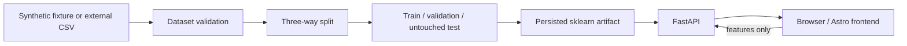

# Architecture

## Problem framing

This project is an educational fraud-scoring portfolio demo. It validates tabular transaction data, trains a reproducible binary classifier, persists the fitted preprocessing and model together, and exposes one trusted inference path for local clients. It is not a production payment decision system.

## Components and boundaries

| Component | Responsibility | Explicit non-responsibilities |
| --- | --- | --- |
| ML core (`src/fraud_detection/data/`, `models/`, `pipeline.py`, `utils/`) | Load and validate CSV data; split data; fit the pipeline; select a validation threshold; evaluate; save and load artifacts; predict. | No HTTP serving, browser rendering, deployment, or training from HTTP requests. |
| CLI (`src/fraud_detection/cli.py`) | Expose `validate-data`, `train`, `evaluate`, and `predict` through `fraud` (or `python -m fraud_detection.cli`). | No browser UI, API server, or remote data service. |
| FastAPI (`src/fraud_detection/api/`) | Load one configured artifact at startup, validate requests, execute inference, and return `/health`, `/model-info`, and `/predict`. | No training, artifact creation/overwriting, data ingestion, or model execution in the browser. |
| Astro frontend (`frontend/`) | Provide a local browser form, load model metadata, submit numeric feature records, and display the response. | Never receives the joblib artifact, never loads sklearn, and never executes or trains the model. |

## Data flow



The training path fits only on the train partition, chooses the classification threshold on validation, and reports test metrics only after that choice. The artifact is written under `models/trained/` and is loaded by FastAPI for inference.

## Trust boundary

FastAPI is the only client-facing runtime that executes the model. The browser sends feature values to `POST /predict` and receives the prediction response; it never receives the persisted artifact. HTTP requests cannot trigger training or overwrite artifacts. Model artifacts are trusted local inputs and should not be loaded from untrusted sources.

## Artifact schema

Current training writes artifact schema `2.0`. Its metadata records:

- model identity, ordered `feature_names`, and the persisted `threshold`;
- threshold selection (`max_f1` on the `validation` split with `highest_threshold` tie-break);
- separate `validation_metrics` and `test_metrics` using the fixed metrics contract: `pr_auc`, `roc_auc`, `recall`, `precision`, `f1`, and `confusion_matrix`;
- split strategy (`random` or `temporal`), optional `timestamp_column`, `split_counts`, and `sample_size`;
- `dataset_sha256`, UTC timestamps, Python version, and runtime package metadata.

The payload is a fitted sklearn `Pipeline` containing `StandardScaler` followed by balanced `LogisticRegression`. Legacy schema `1.0` artifacts remain loadable for compatibility, but do not have the schema 2.0 split and dataset metadata guarantees.

## `/predict` contract example

The request body is a JSON object with one `features` object. Feature names and insertion order must exactly match the loaded artifact; values are finite numbers. The response fields are exactly `is_fraud`, `fraud_probability`, `threshold`, and `model_version`.

Illustrative request and response (the values are an example, not a benchmark):

```json
{
  "features": {
    "amount": 12.5,
    "balance": 240.0
  }
}
```

```json
{
  "is_fraud": false,
  "fraud_probability": 0.08,
  "threshold": 0.5,
  "model_version": "logistic-regression-v1"
}
```

For a real artifact, replace the illustrative feature names with its ordered schema as returned by `GET /model-info`.
